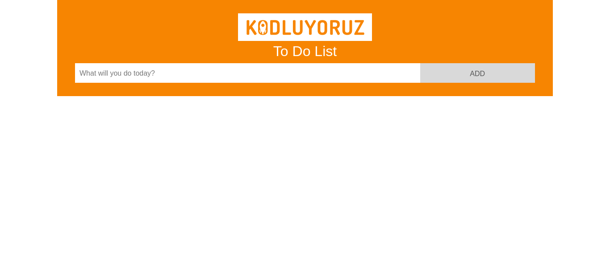
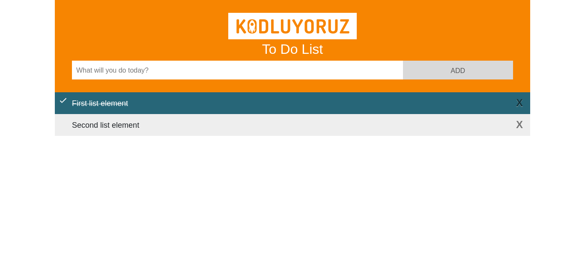
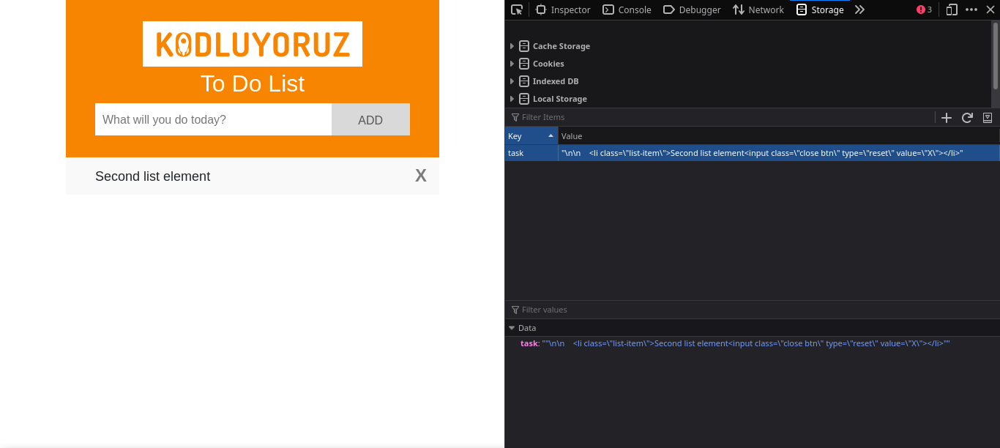
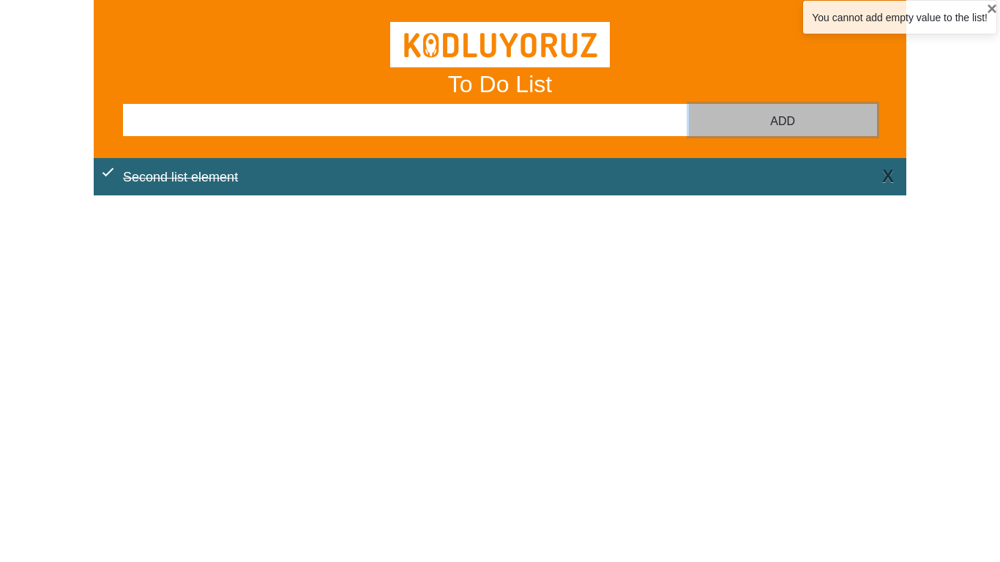
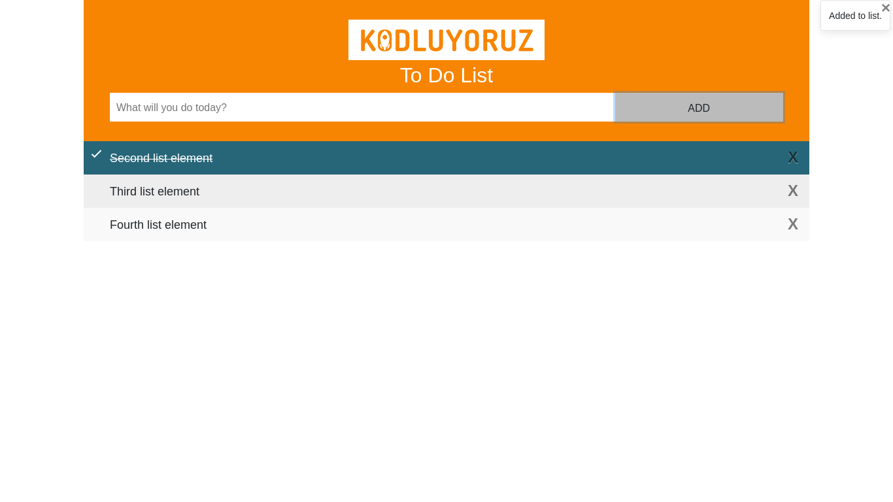

The user can add text to the list, cross out the elements in the list. She can delete any elements she wants.

All changing in page save by local storage.

A notification will appear if the user sends a space as input, tries to send element without value, or if the input is added to the list.

