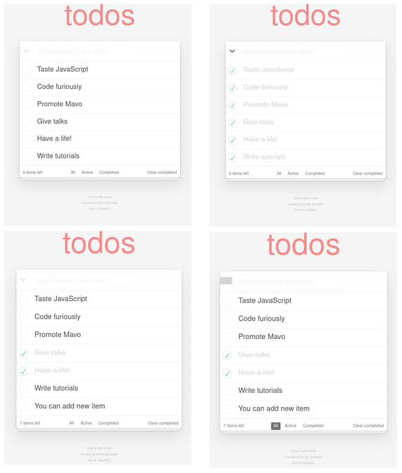
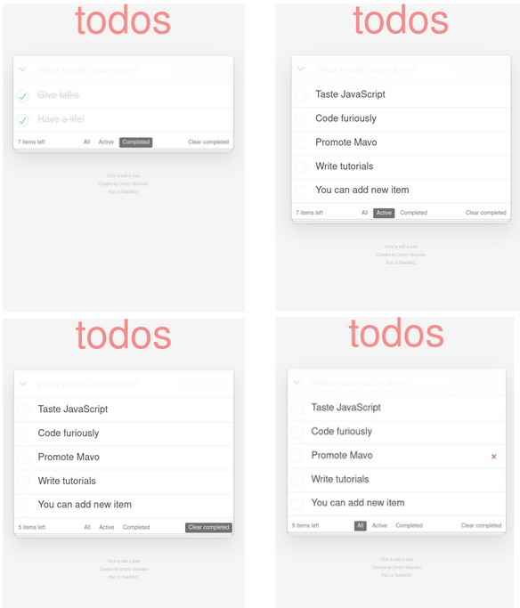

# Patika - To Do App with React

- The user can add items to the list, remove items from the list, and see the items they have added. They can display the entire list, only completed items or incomplete items by filtering.
- The user can mark the items as complete, delete the completed items in bulk.

