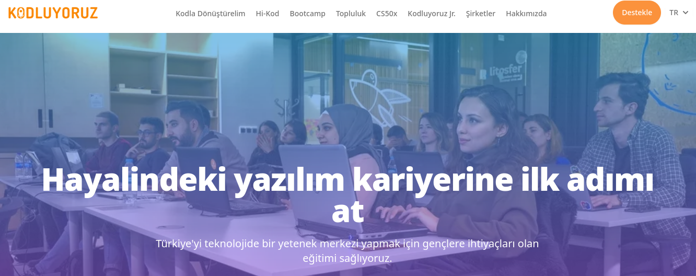

# Kodluyoruz İlk Repo

Bu repo [Kodluyoruz](https://www.kodluyoruz.org/) Front-End Eğitiminde oluşturduğumuz lk repo. İçinde bir adet README dosyası ve bir adet de index.html barındırıyor.



## Installationgir

Öncelikle projeyi clonelayın. (Buraya sizin reponuzdan aldığğınız link gelecek)

` git clone https://github.com/ElifBat/Patika.git`

## Usage

Projeyi cloneladıtan sonra Visual Studio Code programında açınız.

Linux için:

```
cd kodluyoruzilkrepo
code
```

## Contributing

Pull requestler kabul edilir. Büyük değişikler için lütfen önce neyi değiştirmek istediğinizi tartışmak için bir konu açınız.

## License

[MIT](https://choosealicense.com/licenses/mit/)